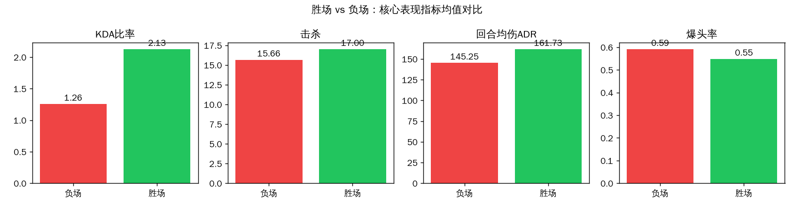
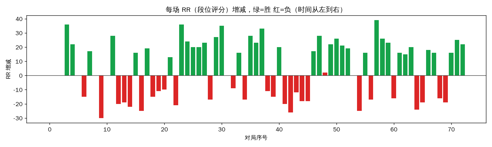
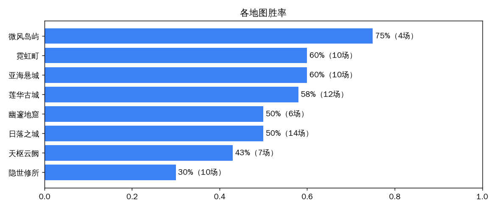
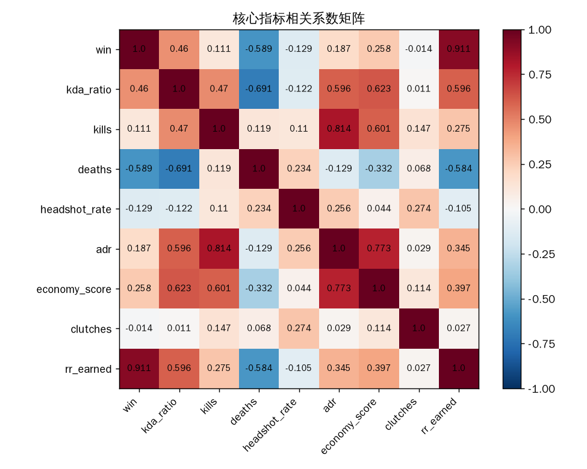
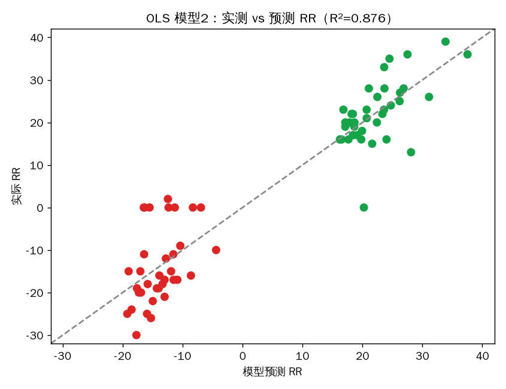

# 无畏契约国服排位表现影响因素分析

基于个人 **73 场国服竞技模式（排位）** 对局数据的统计分析项目。
数据采集 → 清洗 → 假设检验 / 回归 → 可视化，全流程可复现。

| | |
|---|---|
| 游戏 | 《无畏契约》（VALORANT）国服 / WeGame |
| 数据区间 | 2026-07-24 ~ 2026-09-21 |
| 对局数 | 73 场竞技模式（38 胜 35 负，胜率 52.1%） |
| 字段规模 | 40 字段 / 场（含地图、特工、KDA、爆头率、ADR、RR、残局等） |
| 分析方法 | Welch t 检验、卡方检验、游程检验、Pearson 相关、OLS 回归 + 增量 F 检验 |

完整分析结论见 **[`results/分析报告.md`](results/分析报告.md)**。

---

## 核心结论

1. **决定胜负的是「少死」，不是「多杀」**
   负场均死亡 18.1 次、胜场 12.8 次，差异极显著（t=-6.23，p<0.001，效应量 d=-1.44，大效应）；
   而击杀数在胜负组间没有显著差异（p=0.35）。

2. **爆头率、伤害（ADR）与胜负无关**
   爆头率 p=0.28（方向甚至略负），ADR p=0.11——「对枪很刚」不等于「能赢」。

3. **高击杀与获胜基本独立**
   卡方检验 χ²=0.01，p=0.91，比值比 OR=1.18。

4. **连胜连败是随机的，没有「手感 / 心态崩盘」聚集**
   游程检验 p=0.92；最长连胜、连败均为 5 场。「一输一晚上」更多是记忆偏差。

5. **RR（段位评分）主要由胜负决定，KDA 有独立贡献**
   仅用胜负回归 R²=0.830（一胜≈+36 RR，一负≈-14 RR）；
   加入 KDA 等因素后 R²=0.876，增量显著（F 检验 p<0.001），控制胜负后仅 KDA 比率显著。

> 73 场是本人该时段的**全总体而非随机抽样**，结论不外推到其他玩家或段位；
> 回归为关联性分析（KDA 与胜负互为因果），不做因果断言。详见报告「局限性」一节。

---

## 关键图表

**胜场 vs 负场：核心表现指标**



**每场 RR（段位评分）增减**（绿=胜，红=负）



**各地图胜率**



**核心指标相关系数矩阵**



**OLS 模型：实测 vs 预测 RR**（R²=0.876）



---

## 为什么是个人数据

国服（WeGame 渠道）没有 Riot 官方开放 API；第三方战绩接口有**登录地 IP 校验**，
无法从服务器端稳定调用（实测错误码 8000102 / 8000114）。
因此以本人账号全量排位为研究总体，通过浏览器在 WeGame 战绩页采集：
阶段 1-2 走战绩列表 DOM，阶段 3 在页面登录态下调用战绩接口（游标分页拉全量列表 + 逐场详情）。
全程登录态不离开本机。采集细节见 [`docs/`](docs/)。

## 仓库结构

```
├── data/
│   ├── battles_final.json / battles.csv      # 阶段1-2：基础数据
│   ├── battles_detailed.json / .csv          # 阶段3：40字段宽表（分析主数据）
│   └── raw/                                  # 接口原始 JSON
├── scripts/
│   ├── 01_json_to_csv.py                     # 基础 JSON → CSV
│   ├── 02_build_detailed.py                  # 原始数据 → 详情宽表
│   └── 03_analysis.py                        # 假设检验 / 回归 / 出图
├── figures/                                  # 5 张可视化（中文）
├── results/
│   ├── 分析报告.md                            # 人读版完整结论
│   └── analysis_results.json                 # 全部数值结果
├── docs/                                     # 数据采集 / 清洗记录
└── requirements.txt
```

## 复现

```bash
pip install -r requirements.txt
python3 scripts/01_json_to_csv.py     # 基础 JSON → CSV
python3 scripts/02_build_detailed.py  # 原始数据 → 详情宽表
python3 scripts/03_analysis.py        # 全部检验 / 回归 / 图表，输出到 results/ 与 figures/
```

## License

[MIT](LICENSE)
